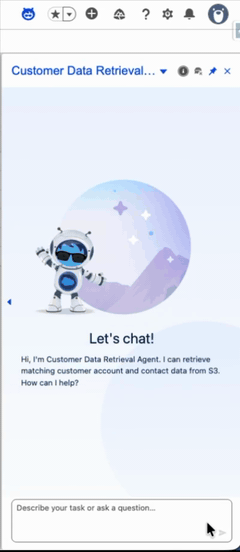

# Agentforce S3 Customer Viewer

This Salesforce DX repository contains a S3-only Agentforce implementation for `Customer Data Retrieval Agent`.

It contains only the customer data retrieval path and omits non-S3 form/action metadata.

## Demo



## Included Metadata

- Agentforce authoring bundle: `Customer_Data_Retrieval_Agent`
- Apex: `S3AccountAgentAction`, S3 request/response DTOs, and `S3AccountAgentActionTest`
- Lightning Web Components: `s3AccountRenderer`, `s3AccountEditor`
- Custom Lightning Types: `s3AccountViewer`, `s3AccountRequest`
- Callout configuration: `AWS_S3_Demo` Named Credential and External Credential
- Permission set: `Customer_Data_Retrieval_Agent_Access`

## Configure AWS

Follow the detailed setup guide:

- [S3 Bucket and Salesforce Named Credential Setup](S3_BUCKET_AND_NAMED_CREDENTIALS.md)

At minimum, create an S3 bucket and upload:

```text
accounts.json
account.json
```

The Apex action reads `/accounts.json` first and falls back to `/account.json`.

## Prepare Salesforce Metadata

Before deploying, replace the placeholder AWS account ID in:

```text
force-app/main/default/externalCredentials/AWS_S3_Demo.externalCredential-meta.xml
```

Replace:

```xml
<parameterValue>testvalue</parameterValue>
```

with your own 12-digit AWS account ID.

If your bucket name or region differs from the example, update the URL in:

```text
force-app/main/default/namedCredentials/AWS_S3_Demo.namedCredential-meta.xml
```

## Deploy

Authorize the target org:

```bash
sf org login web --alias targetOrgAlias --set-default
```

Deploy the base S3 and Agentforce metadata first:

```bash
sf project deploy start \
  --manifest manifest/package.xml \
  --target-org targetOrgAlias \
  --test-level RunSpecifiedTests \
  --tests S3AccountAgentActionTest \
  --wait 10
```

This deploy includes the Agentforce authoring bundle, Apex, custom Lightning types, LWCs, External Credential, and Named Credential. It does not include the permission set because the permission set references the published agent Bot definition.

After deployment, open Salesforce Setup and configure the `AWS_S3_Demo` External Credential principal with your AWS access key and secret. Salesforce stores the secret; it is not stored in source.

Validate and publish the agent:

```bash
sf agent validate authoring-bundle \
  --api-name Customer_Data_Retrieval_Agent \
  --target-org targetOrgAlias

sf agent publish authoring-bundle \
  --api-name Customer_Data_Retrieval_Agent \
  --target-org targetOrgAlias
```

Deploy the permission set after the agent is published:

```bash
sf project deploy start \
  --manifest manifest/permission-set-package.xml \
  --target-org targetOrgAlias \
  --wait 10
```

Assign permissions:

```bash
sf org assign permset \
  --name Customer_Data_Retrieval_Agent_Access \
  --target-org targetOrgAlias
```

For a dedicated Agentforce user:

```bash
sf org assign permset \
  --name Customer_Data_Retrieval_Agent_Access \
  --on-behalf-of agent.user@example.com \
  --target-org targetOrgAlias
```

After activating the agent, confirm the permission set has Agent Access:

1. Open Salesforce Setup.
2. Go to **Permission Sets**.
3. Open **Customer Data Retrieval Agent Access**.
4. Open **Agent Access**.
5. Choose **Customer Data Retrieval Agent**.
6. Save the permission set.

## Deployment Verification

This deployment flow was verified against the local target org alias `webCrawling`.

Successful commands:

```bash
sf project deploy start \
  --manifest manifest/package.xml \
  --target-org webCrawling \
  --test-level RunSpecifiedTests \
  --tests S3AccountAgentActionTest \
  --wait 10 \
  --json

sf agent validate authoring-bundle \
  --api-name Customer_Data_Retrieval_Agent \
  --target-org webCrawling \
  --json

sf agent publish authoring-bundle \
  --api-name Customer_Data_Retrieval_Agent \
  --target-org webCrawling \
  --json

sf project deploy start \
  --manifest manifest/permission-set-package.xml \
  --target-org webCrawling \
  --wait 10 \
  --json

sf org assign permset \
  --name Customer_Data_Retrieval_Agent_Access \
  --target-org webCrawling \
  --json
```

Verified results:

- Base metadata deploy succeeded with 13 deployed components.
- `S3AccountAgentActionTest` ran 19 tests with 0 failures.
- Agent validation succeeded.
- Agent publish succeeded and created the `Customer_Data_Retrieval_Agent` Bot definition.
- Permission set deploy succeeded after publishing the agent.
- Permission set assignment succeeded for the target org user.

## Troubleshooting

### Permission set fails with missing Bot definition

Error:

```text
PermissionSet Customer_Data_Retrieval_Agent_Access
In field: botDefinition - no Bot named Customer_Data_Retrieval_Agent found
```

Cause:

The permission set contains agent access for `Customer_Data_Retrieval_Agent`. Salesforce validates that access against the agent's generated Bot definition, but the Bot definition does not exist until after the Agentforce authoring bundle is validated and published.

Fix:

1. Deploy `manifest/package.xml`.
2. Run `sf agent validate authoring-bundle`.
3. Run `sf agent publish authoring-bundle`.
4. Deploy `manifest/permission-set-package.xml`.
5. Assign `Customer_Data_Retrieval_Agent_Access`.
6. After activation, open **Customer Data Retrieval Agent Access** in Setup and confirm **Agent Access** includes **Customer Data Retrieval Agent**.

### Agent publish creates local generated metadata

`sf agent publish authoring-bundle` can generate local metadata under:

```text
force-app/main/default/bots/
force-app/main/default/genAiPlannerBundles/
```

Those files are generated from the Agentforce authoring bundle and can include org-specific generated names. This project keeps `AiAuthoringBundle` as the source of truth and ignores the generated publish output in `.gitignore` and `.forceignore`.

## Use

Open `Customer Data Retrieval Agent` in Agent Builder, activate the published version, and commit the draft version before previewing or testing.

Do not skip the Agent Builder commit step after creating or editing a version. Preview can show `Something went wrong. Refresh and try again.` while the agent is still in a draft version such as `Version 3 (Draft)`. Commit the version first, then run Preview or Live Test Mode.

Preview with:

```text
Give me info for my accounts.
```

The agent opens the S3 Account Data form. Enter an account name and submit. The renderer calls `S3AccountAgentAction.lookupAccounts`, reads from `callout:AWS_S3_Demo/accounts.json`, and displays matching accounts and contacts.
